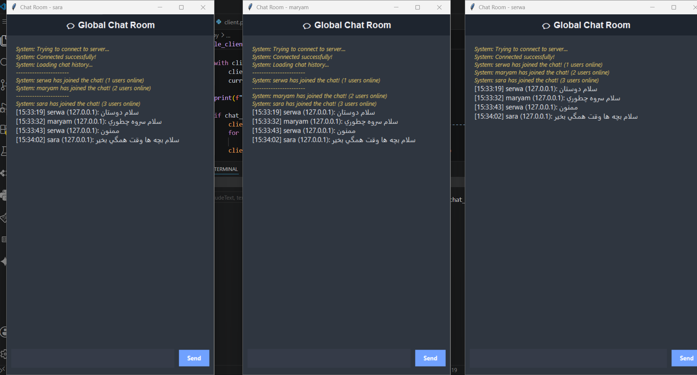
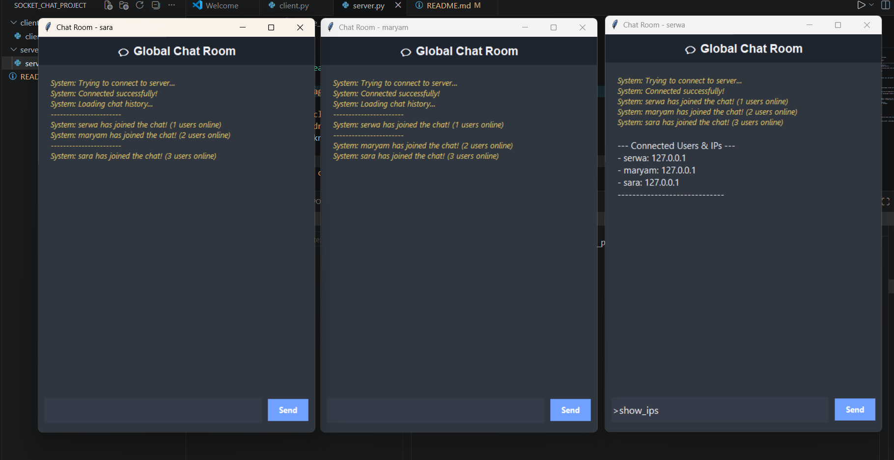
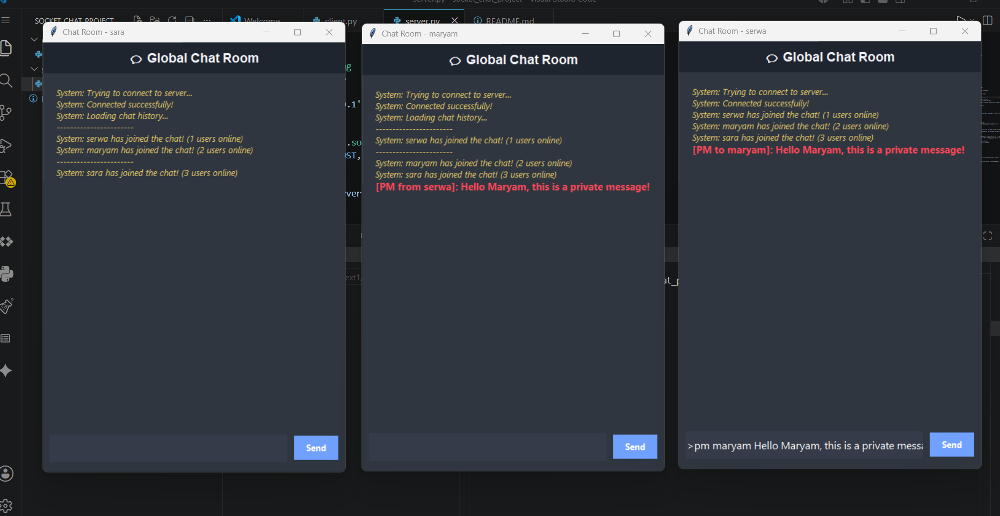

# Socket Chat Application

A multi-client, real-time chat application built with Python, utilizing socket programming, multi-threading, and Tkinter for a graphical user interface.

## 👥 Project Members
- **Serve Rabani and Maryam Karimi** - [GitHub Profile](https://github.com/serwarabani) and [Hamgit](https://hamgit.ir/maryamkarimi8405)

---

### بخش اول: سیر تکاملی و توضیحات فازهای پروژه

### فاز ۱: برقراری ارتباط پایه (Basic Connection)
این فاز، سنگ بنای پروژه و هدف آن اثبات صحت عملکرد پروتکل انتقال داده در لایه ترنسپورت (Transport Layer) بود. در این مرحله، یک ساختار معماری کلاینت-سرور (Client-Server Architecture) پایه‌ای با استفاده از پروتکل TCP و کتابخانه استاندارد socket در پایتون پیاده‌سازی شد. سرور به یک پورت مشخص (پورت ۵۰۰۰) و آی‌پي لوکال (127.0.0.1) متصل (Bind) شده و در حالت گوش‌به‌زنگ (Listen) قرار گرفت. در این فاز، کلاینت پس از برقراری دست‌تکانی سه‌مرحله‌ای (3-way handshake)، یک پیام متنی ساده برای سرور ارسال می‌کرد. سرور به محض دریافت پیام، آن را در خروجی استاندارد خود چاپ کرده و بلافاصله اتصال را می‌بست.
دستاورد فنی: درک لایه سوکت، نحوه باز و بسته کردن کانال‌های ارتباطی و اطمینان از عدم مسدود بودن پورت‌های سیستم‌عامل.

### فاز ۲: پشتیبانی از چند کلاینت همزمان (Multi-Client Support)
در فاز اول، سرور به صورت تک‌ترید (Single-threaded) کار می‌کرد؛ یعنی به محض اتصال یک کلاینت، سرور بلاک (Block) می‌شد و هیچ کلاینت دیگری نمی‌توانست تا زمان بسته شدن اتصال قبلی به شبکه وصل شود. برای حل این مشکل اساسی، در فاز دوم مفهوم چندریسگی (Multi-threading) با استفاده از ماژول threading پایتون به پروژه تزریق شد. ساختار سرور به این صورت دگرگون شد که حلقه اصلی سرور (while True) صرفاً وظیفه گوش دادن و پذیرش (accept) اتصالات جدید را بر عهده دارد. به محض متصل شدن یک کاربر، سرور یک ترید اختصاصی (Worker Thread) برای آن کاربر ایجاد می‌کند و مدیریت ارسال و دریافت پیام‌های آن کاربر را به آن ترید می‌سپارد.

دستاورد فنی: عبور از محدودیت مسدودسازی (Non-blocking I/O)، مدیریت همزمانی (Concurrency) و توانایی پاسخگویی به بی‌نهایت کاربر به صورت همزمان.

### فاز ۳: انتشار پیام‌ها و خروج امن (Broadcast & Secure Disconnection)
در این فاز، پروژه از یک ارتباط نقطه‌به‌نقطه (Point-to-Point) به یک اتاق چت گروهی (Chat Room) تبدیل شد. چالشی که در این فاز حل شد، مکانیزم توزیع داده بود. یک تابع کلیدی به نام broadcast تعریف شد؛ وظیفه این تابع این است که وقتی فرستنده‌ای پیامی را به تریدِ خود در سرور تحویل می‌دهد، سرور با چرخیدن روی یک ساختار داده (دیکشنری کلاینت‌ها)، آن پیام را به سوکت تک‌تک اعضای آنلاین دیگر بفرستد. علاوه بر این، پروتکل خروج امن پیاده‌سازی شد. اگر کاربری کلمه کلیدی /exit را تایپ کند، سرور ابتدا سوکت آن کاربر را به صورت استاندارد می‌بندد، منابع سیستم‌عامل را آزاد می‌کند، او را از لیست افراد آنلاین حذف کرده و با یک پیام سیستمیک به سایر اعضا اعلام می‌کند که این کاربر چت‌روم را ترک کرده است.

دستاورد فنی: مدیریت صحیح بافر شبکه، پیاده‌سازی منطق توزیع داده (Publish-Subscribe) و مدیریت چرخه حیات سوکت‌ها (Socket Lifecycle)

### فاز ۴: رابط گرافیکی و قابلیت‌های پیشرفته (GUI & Advanced Features)
فاز چهارم (بخش امتیازی) نقطه تکامل و تبدیل این اسکریپت ترمینالی به یک نرم‌افزار تجاری و کاربرپسند است. در این فاز، با استفاده از کتابخانه Tkinter پایتون، یک رابط گرافیکی (GUI) کاملاً واکنشی طراحی شد تا کاربران نیازی به کار با محیط خسته‌کننده ترمینال نداشته باشند. علاوه بر دگرگونی بصری، قابلیت‌های پیشرفته لایه اپلیکیشن (Application Layer) مانند احراز هویت اولیه کاربران با نام کاربری، تخصیص برچسب زمانی به پیام‌ها برای مستندسازی، پیاده‌سازی دستورات فیلترکننده داده مثل نمایش IPها و مهم‌تر از همه، پروتکل پیام خصوصی (Private Messaging) طراحی و با موفقیت به سیستم اضافه شد.

دستاورد فنی: جداسازی منطق شبکه از منطق فرانت‌اند (Separation of Concerns)، کار با Threadها در محیط‌های گرافیکی و پیاده‌سازی کامندهای اختصاصی روی سوکت.

---

## لیست کامل قابلیت‌های فاز ۴، توضیحات و نحوه نمایش
## ۱. رابط کاربری گرافیکی متمایز (Tkinter Chat GUI)
   نرم‌افزار به یک پوسته گرافیکی دوپنجره‌ای مجهز شده است (پنجره اول برای ورود نام کاربری و پنجره دوم اتاق چت اصلی). در طراحی چت‌روم از تم تاریک (Dark Mode) استفاده شده است تا علاوه بر زیبایی، خوانایی پیام‌ها بالا برود. این رابط شامل بخش نمایش پیام‌ها با قابلیت اسکرول خودکار و کادر ارسال متن است.
  [chat-GUI](chat-gui.png)

## ۲. سیستم هویت‌سنجی و نام کاربری (Username Handshake)
   به محض باز شدن کلاینت، برنامه از کاربر می‌خواهد یک نام کاربری برای خود انتخاب کند. این نام به سرور پاس داده می‌شود. سرور در ساختار داده قفل‌شده خود، سوکتِ آن کلاینت را به نام کاربری‌اش متصل می‌کند تا از این به بعد کاربر در شبکه با نام خودش شناخته شود، نه با آی‌پي ناشناس.
   [Username-Handshake](username-handshake.png)

## ۳. مدیریت خطا و بازیابی خودکار اتصال (Auto-Reconnect System)
   یکی از مهم‌ترین معیارهای پذیرش استاد، پایداری چت است. در کد کلاینت، تابع دریافت پیام در یک بلوک try-except محافظت می‌شود. اگر به هر دلیلی (مثل قطعی موقت سرور یا شبکه) اتصال سوکت قطع شود (socket.error)، برنامه کرش نمی‌کند؛ بلکه وارد یک حلقه زمان‌بندی شده می‌شود و هر چند ثانیه یک‌بار تلاش می‌کند بدون بستن رابط گرافیکی، اتصال را با سرور بازیابی کند.
   [Auto-Recconect-Sustem](auto-reconnect.png)

## ۴. برچسب زمانی پیام‌ها (Message Timestamping)
   با استفاده از ماژول datetime پایتون، سرور به محض دریافت هر پیام عمومی از هر کلاینت، زمان دقیق سرور (ساعت:دقیقه:ثانیه) را محاسبه کرده و به ابتدای رشته‌ی پیام می‌چسباند تا ترتیب زمانی گفتگوها حفظ شود.
   [Message-Timestamping](Message-Timestamping.png)

## ۵. پروتکل پیام خصوصی هوشمند و کاربرمحور (>pm <username> <message>)
   در طراحی‌های سنتی، پیام خصوصی بر اساس IP فیلتر می‌شود؛ اما از آنجایی که در محیط‌های محلی (Local Network) یا هنگام تست روی یک سیستم، آدرس IP تمام کلاینت‌ها یکسان (127.0.0.1) است، تفکیک کاربران بر اساس IP ناممکن می‌شود. برای حل این چالش لایه اپلیکیشن، معماری سرور را به صورت کاربرمحور (Username-based) بازنویسی کردیم. سرور پیام‌هایی که با کلمه کلیدی >pm شروع می‌شوند را تجزیه کرده، نام کاربری مقصد را استخراج می‌کند و با جستجو در دیکشنری، پیام را فقط و فقط به سوکت کلاینتی که با آن نام کاربری منحصربه‌فرد متصل است می‌فرستد. این روش علاوه بر حل مشکل آدرس‌های لوکال، تجربه کاربری بسیار بهتری (شبیه به پیام‌رسان‌های واقعی) ارائه می‌دهد.
   [Private-Message](private-message.png)

## دستور نمایش زنده لیست کاربران و آی‌پي‌ها (>show_ips)
   یک دستور اختصاصی لایه اپلیکیشن است که به هر کاربر اجازه می‌دهد در هر لحظه، شناسنامه شبکه چت‌روم را ببیند. با تایپ این دستور، سرور لیستی از نام کاربری و IP تمام کلاینت‌های آنلاین تهیه کرده و آن را صرفاً برای خودِ شخصِ درخواست‌کننده کپسوله‌سازی و ارسال می‌کند.
   [>show_ips](show-ips.png)

## ۷. ایمن‌سازی همزمانی داده‌ها (Thread-Safe Dictionary with Lock)
   به دلیل ماهیت مالتی-تردینگ پروژه، چندین ترید به صورت همزمان ممکن است بخواهند لیست کلاینت‌ها را ویرایش کنند (یک نفر خارج شود، یک نفر وارد شود و یک نفر دستور >show_ips بزند). برای جلوگیری از خطای مخدوش شدن داده‌ها یا Race Condition، از مکانیزم threading.Lock() استفاده شده است. هر ترید برای دسترسی به لیست کلاینت‌ها ابتدا باید قفل را تصاحب کند (with clients_lock:).

## ۸. مدیریت هوشمند بافر حافظه (Memory Optimization for History)
   برای جلوگیری از مصرف حافظه رم (RAM) سرور در اثر چت‌های طولانی‌مدت، قابلیت سقف مجاز تاریخچه پیام‌ها روی ۵۰ تنظیم شده است (MAX_HISTORY = 50). این بافر ساختاری شبیه به صف (Queue) دارد؛ به محض ارسال پیام ۵۱ام، قدیمی‌ترین پیام از ابتدای آرایه حذف می‌شود (chat_history.pop(0)). همچنین هر کاربر جدیدی که وارد چت‌روم شود، سرور ابتدا این تاریخچه پیام‌ها را برای او بارگذاری می‌کند.

## ۹. بهینه‌سازی فرآیندهای پس‌زمینه با تریدهای دیمون (Daemon Threads)
   در سمت سرور، تمام تریدهای فرزند کلاینت‌ها به صورت thread.daemon = True ساخته می‌شوند. این ویژگی باعث می‌شود که طول عمر تریدهای فرزند کاملاً وابسته به فرآیند اصلی سرور باشد و در صورت بسته شدن ناگهانی سرور، سیستم‌عامل پورت ۵۰۰۰ را قفل نگه ندارد.

---

## 📸 Screenshots

### 1. Main Chat Interface


### 2. User List (>show_ips)


### 3. Private Messaging (>pm)


---

## 🚀 How to Run

1. **Start the Server:**
   ```bash
   python server.py
2. **Start the client:**
   ```bash
   python client.py